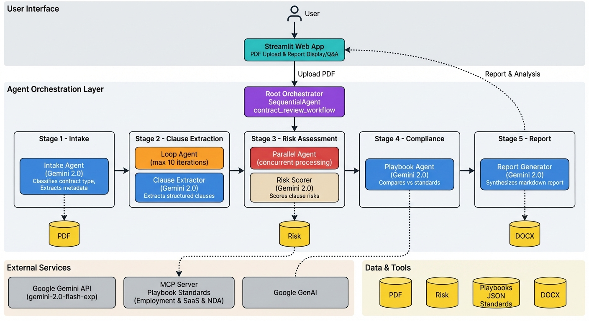

<div align="center">
  
  
  <h1>LegalLens AI</h1>
  
  <p><strong>Orchestrating Sequential, Parallel, and Loop Agents for Real-Time Legal Assessment</strong></p>

  [](https://www.python.org/downloads/)
  [](https://github.com/google/adk)
  [](https://ai.google.dev/)
  [](https://streamlit.io/)
  [](https://opensource.org/licenses/MIT)
  
  <h3>
    <a href="https://youtu.be/bYt8kRoo0A8">🎥 Watch Demo Video</a> •
    <a href="#-installation">📦 Installation</a> •
    <a href="#-usage">🚀 Usage</a> •
    <a href="#%EF%B8%8F-architecture">🏗️ Architecture</a>
  </h3>
</div>

**A production-ready multi-agent system that automates comprehensive contract review in minutes, not hours.**

---

## 🎯 The Problem

Contract review is a critical yet bottlenecked process in legal operations. Organizations face:

- ⏰ **Time Constraints**: Manual review takes 2-3 hours per contract
- 💰 **Cost Barriers**: Professional legal review costs $200-500/hour
- 🎲 **Inconsistency**: Different reviewers apply varying standards
- 📈 **Scalability Issues**: Cannot efficiently process contract portfolios
- ⚠️ **Hidden Risks**: Non-lawyers miss critical clauses

These challenges create real consequences: missed deadlines, expensive legal fees, overlooked risks, and deals falling through. The problem is particularly acute for individuals and small organizations who need legal protection but cannot afford traditional review services.

---

## 🤖 Why Agents?

Agents are the ideal solution because contract review inherently requires **specialized expertise working in coordination**:

### **Decomposition of Complex Expertise**
Contract review isn't monolithic—it requires distinct skills: classification, extraction, risk assessment, compliance checking, and synthesis. Each skill maps naturally to a specialized agent.

### **Parallel Processing**
Risk assessment is embarrassingly parallel. Each clause can be evaluated independently. While a single LLM could score clauses sequentially, a parallel agent architecture processes all clauses simultaneously, dramatically reducing analysis time.

### **Iterative Refinement**
Clause extraction requires iteration. A loop agent can systematically work through sections, adapting its extraction strategy based on document format, until all clauses are captured.

### **Progressive Disclosure**
Agents enable real-time progress tracking. Users see exactly which stage is running, how many clauses have been found, and when analysis is complete—creating transparency impossible with monolithic LLM approaches.

---

## 🏗️ Architecture

LegalLens AI employs a **hierarchical orchestration pattern** with a SequentialAgent root coordinating five specialized stages:

<div align="center">
  
  <p><em>Complete system architecture showing multi-agent orchestration flow</em></p>
</div>


### **Stage 1: Contract Intake** (Sequential Agent)
- Classifies contract type (Employment, SaaS, NDA, MSA)
- Extracts metadata: parties, dates, jurisdiction, governing law
- Assesses document quality

### **Stage 2: Clause Extraction** (Loop Agent)
- Iteratively extracts clauses section-by-section
- Identifies clause types (compensation, non-compete, IP, termination, etc.)
- Captures key terms with confidence scores
- **Max 10 iterations** for comprehensive coverage

### **Stage 3: Risk Assessment** (Parallel Agent)
- Concurrently evaluates risk for all clauses
- Assigns risk levels: CRITICAL (9-10), HIGH (7-8), MEDIUM (4-6), LOW (1-3)
- Identifies risk factors and provides recommendations
- **Processes multiple clauses simultaneously** for speed

### **Stage 4: Playbook Compliance** (Sequential Agent + MCP)
- Compares terms against company playbook standards
- Uses **MCP (Model Context Protocol)** server for standards database
- Generates deviation analysis with compliance status

### **Stage 5: Report Generation** (Sequential Agent)
- Synthesizes all findings into comprehensive Markdown report
- Includes executive summary, critical issues, negotiation strategy
- Provides clause-by-clause analysis and playbook comparison

---

## ✨ Key Features

### 🎭 **Multi-Agent Orchestration**
- **3 Agent Types Demonstrated**: Sequential, Loop, and Parallel
- **5 Specialized Agents**: Each with domain-specific expertise
- **Hierarchical Coordination**: Root orchestrator managing workflow

### ⚡ **Real-Time Progress Tracking**
- Weighted progress bar (Intake 15% → Extraction 25% → Risk 25% → Playbook 20% → Report 15%)
- Stage-by-stage status updates with emojis
- Live agent traces in sidebar showing reasoning

### 📊 **Comprehensive Analysis**
- **Metadata Extraction**: Parties, dates, jurisdiction, governing law
- **Clause Identification**: 13+ clause types with key terms
- **Risk Scoring**: 4-level risk assessment with detailed factors
- **Playbook Compliance**: Deviation analysis against standards
- **Negotiation Strategy**: Prioritized recommendations

### 💬 **Interactive Q&A**
- Context-aware chatbot powered by Gemini
- Ask questions about any contract clause
- References both contract text and analysis report

### 📝 **Professional Reporting**
- Structured Markdown with tables and emojis
- One-click export to DOCX format
- Copy-to-clipboard for easy sharing

### 🔌 **MCP Integration**
- Custom Model Context Protocol server
- JSON-formatted playbook standards
- Extensible for different contract types

---

## 🛠️ Tech Stack

### **Core Framework**
- **Google ADK** - Agent Development Kit for multi-agent orchestration
- **Gemini 2.0 Flash** - LLM powering all 5 agents
- **Python 3.10+** - Primary development language

### **UI & Frontend**
- **Streamlit** - Web interface with real-time updates
- **Custom CSS** - Dark mode styling and responsive design

### **Tools & Utilities**
- **PyPDF2** - PDF text extraction
- **python-docx** - Report export to DOCX
- **MCP (Model Context Protocol)** - Playbook standards server
- **python-dotenv** - Environment variable management

### **External APIs**
- **Google Gemini API** - Agent LLM calls
- **Google GenAI** - Chat Q&A functionality

---

## 📦 Installation

### Prerequisites
- Python 3.10 or higher
- Google API key ([Get one here](https://ai.google.dev/))

### Step 1: Clone the Repository
```bash
git clone https://github.com/sameeerjadhav/contract_reviewer.git
cd contract_reviewer
```

### Step 2: Create Virtual Environment
```bash
python -m venv contract_reviewer
source contract_reviewer/bin/activate  # On Windows: contract_reviewer\Scripts\activate
```

### Step 3: Install Dependencies
```bash
pip install -r requirements.txt
```

### Step 4: Configure Environment
```bash
# Create .env file
cp .env.example .env

# Edit .env and add your API key
GOOGLE_API_KEY=your_api_key_here
```

---

## 🚀 Usage

### Option 1: Web Interface (Recommended)

```bash
streamlit run app.py
```

Then open your browser to: **http://localhost:8501**

**Features:**
- 📄 PDF viewer (left column)
- 📊 Report display (right column)
- 🕵️ Agent traces (sidebar)
- 💬 Interactive Q&A (bottom)
- 💾 Download as DOCX

### Option 2: Batch Processing

Process multiple contracts at once:

```bash
# 1. Place PDFs in input folder
cp /path/to/contracts/*.pdf input_contracts/

# 2. Run batch processor
python run_batch.py

# 3. Get reports from output folder
ls output_reports/
```

### Option 3: Single Contract CLI

```bash
python run_single.py path/to/contract.pdf
```

---

## 🎥 Demo Video

<div align="center">
  <a href="https://youtu.be/bYt8kRoo0A8">
    
  </a>
  
  <p><strong><a href="https://youtu.be/bYt8kRoo0A8">▶️ Watch Full Demo on YouTube</a></strong></p>
  
  <p><em>See LegalLens AI analyze a 6-page employment contract in under 3 minutes</em></p>
</div>

---

## 📊 Demo Walkthrough

### **Upload Contract**
User uploads a 6-page employment contract PDF

### **Real-Time Progress**
```
🚀 Starting analysis...
  ↓
⏳ 📋 Contract Intake - In Progress...
✅ 📋 Contract Intake - Complete [15%]
  ↓
⏳ 📄 Clause Extraction - In Progress...
✅ 📄 Clause Extraction - Complete [40%]
  ↓
⏳ ⚠️ Risk Assessment - In Progress...
✅ ⚠️ Risk Assessment - Complete [65%]
  ↓
⏳ 📚 Playbook Compliance - In Progress...
✅ 📚 Playbook Compliance - Complete [85%]
  ↓
⏳ 📝 Report Generation - In Progress...
✅ 📝 Report Generation - Complete! [100%]
```

### **Generated Report**
**Executive Summary**: High-level contract overview and key findings

**Critical Issues ❌**:
- Unpaid Position: This offers no compensation, potentially violating labor laws

**High-Priority Issues ⚠️**:
- Broad Non-Compete: 12-month restriction within 100-mile radius

**Acceptable Terms ✅**:
- Clear Position and Duties
- Fixed Term of Employment (6 months)
- Defined Reporting Structure

**Negotiation Strategy**: Prioritized talking points for compensation and non-compete

**Clause-by-Clause Analysis**: Detailed table with risk levels and recommendations

**Total Analysis Time**: 2-3 minutes for 6-page contract


---

## 🎓 ADK Concepts Demonstrated

This project showcases **8 core ADK capabilities**:

| Category | Concept | Implementation |
|----------|---------|----------------|
| **Multi-Agent** | Sequential Agent | `contract_review_workflow` orchestrates 5 stages |
| | Loop Agent | `clause_extraction_loop` iterates through sections |
| | Parallel Agent | `risk_scoring_parallel` scores clauses concurrently |
| | LLM Agent | 5 specialized Gemini-powered agents |
| **Tools** | MCP Server | `PlaybookServer` for standards database |
| | Custom Tools | `pdf_parser`, `risk_matrix`, `docx_generator` |
| **Sessions** | State Management | `InMemoryRunner` + `st.session_state` |
| **Observability** | Logging & Tracing | `run_debug()` streams to UI sidebar |

---

## 📁 Project Structure

```
legal_ai_project/
├── app.py                          # Streamlit web UI
├── run_single.py                   # CLI for single contract
├── run_batch.py                    # Batch processor
├── requirements.txt                # Python dependencies
├── .env.example                    # Environment template
│
├── src/
│   ├── __init__.py
│   ├── agent.py                    # 5 ADK agents + orchestration
│   ├── config.py                   # Configuration & model settings
│   │
│   ├── tools/
│   │   ├── __init__.py
│   │   ├── pdf_parser.py           # PDF text extraction
│   │   └── risk_matrix.py          # Risk scoring logic
│   │
│   ├── mcp/
│   │   ├── __init__.py
│   │   └── playbook_server.py      # MCP server for standards
│   │
│   └── utils/
│       ├── __init__.py
│       └── docx_generator.py       # Markdown to DOCX converter
│
├── data/
│   └── playbooks/
│       ├── employment_agreement.json
│       ├── saas_agreement.json
│       ├── nda.json
│       └── msa.json
│
├── input_contracts/                # Place PDFs here for batch
├── output_reports/                 # Generated reports
└── README.md
```

---

## 🎯 Use Cases

1. **Startups**: Review vendor contracts before signing
2. **HR Teams**: Analyze employment offer letters for compliance
3. **Legal Ops**: Bulk process contract portfolios
4. **Small Businesses**: Get quick contract reviews without expensive lawyers
5. **Individuals**: Understand employment offers and service agreements
6. **Education**: Teach students about AI agents and legal tech

---

## 🔮 Future Enhancements

### **Near-Term (Next 3 Months)**
- [ ] **Token-Level Streaming**: Implement Gemini's streaming API for real-time report generation
- [ ] **Custom Playbooks**: UI for uploading organization-specific playbook standards
- [ ] **Multi-Language Support**: Extend to contracts in Spanish, French, Mandarin

### **Medium-Term (3-6 Months)**
- [ ] **RAG Integration**: Vector search for large documents (50+ pages)
- [ ] **Memory Bank**: Long-term learning from user feedback
- [ ] **Agent Evaluation**: Automated testing with golden datasets

### **Long-Term (6-12 Months)**
- [ ] **Redline Generation**: Auto-generate suggested contract edits
- [ ] **A2A Protocol**: Agent-to-agent negotiation simulation
- [ ] **Workflow Customization**: Visual editor for custom orchestration
- [ ] **Advanced Analytics**: Portfolio trend analysis and insights

---

## 🤝 Contributing

Contributions are welcome! Please:

1. Fork the repository
2. Create a feature branch (`git checkout -b feature/amazing-feature`)
3. Commit your changes (`git commit -m 'Add amazing feature'`)
4. Push to the branch (`git push origin feature/amazing-feature`)
5. Open a Pull Request

---

## 📄 License

This project is licensed under the MIT License - see the [LICENSE](LICENSE) file for details.

---

## 🙏 Acknowledgments

- **Google ADK Team** - For the excellent Agent Development Kit
- **Streamlit** - For the intuitive web framework
- **Gemini API** - For powerful LLM capabilities

---

## 📧 Contact

**Sameer Narendra Jadhav**  
LegalLens AI - Multi-Agent Contract Review System

For questions or feedback, please open an issue on GitHub.

---

## 🎓 Academic Context

This project was developed as a capstone demonstration of:
- Multi-agent system design and orchestration
- Production-grade AI application development
- Legal tech automation and accessibility
- Full-stack implementation with modern frameworks

**Core Technologies**: Google ADK, Gemini 2.0 Flash, Streamlit, Python, MCP

**Built with ❤️ to democratize legal contract review**
